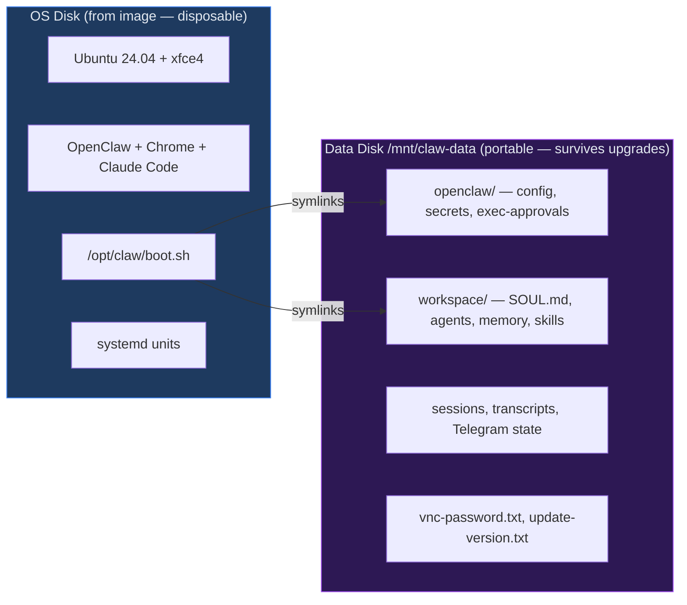
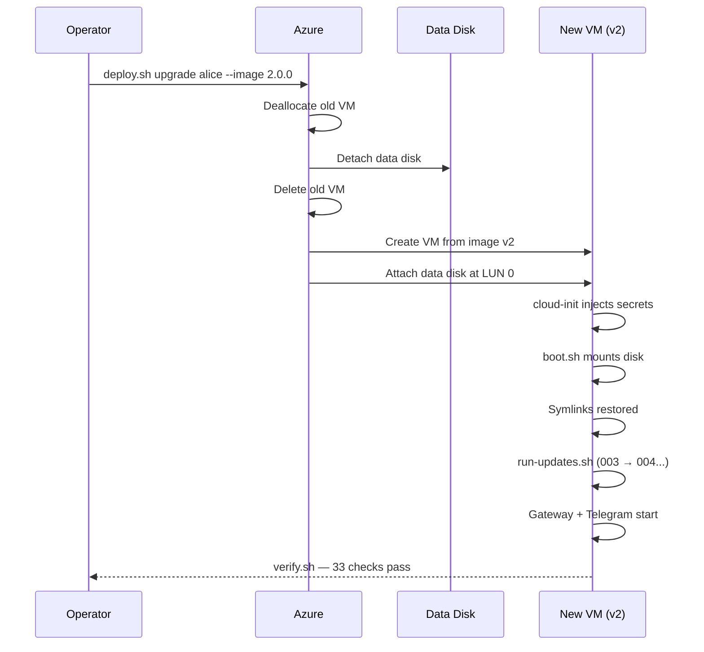
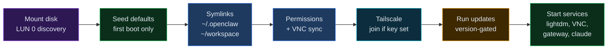
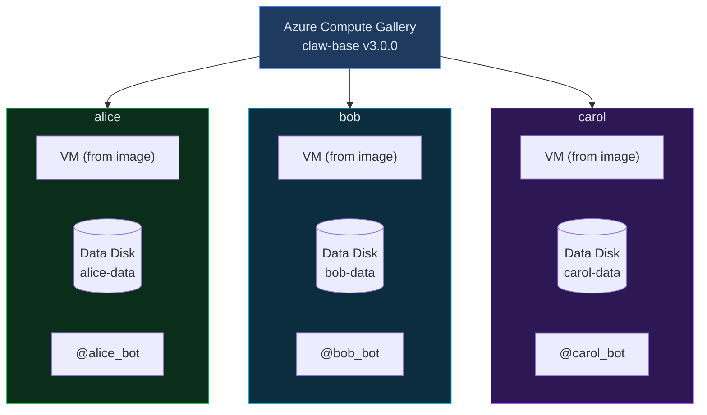

<p align="center">
  
</p>

# OpenClawps

MLOps-inspired CI/CD for [OpenClaw](https://openclaw.ai) agent fleets. Prescriptive, versioned system images provide a managed runtime. Portable data disks carry agent identity, workspace, and state across VM replacements and image upgrades. Deploy a fully equipped, desktop-running claw on Azure in one command. Upgrade it without losing state in another.

Architecture diagrams and topology: [challengelogan.com/openclawps](https://challengelogan.com/openclawps)

## What this adds to OpenClaw

- **One-command Azure deploy** -- `deploy.sh scratch` goes from zero to a working agent with Telegram, Chrome, and Claude Code in ~10 min. No manual VM setup.
- **Full graphical desktop** -- Real xfce4 desktop on `:0` with Chrome and VNC. Computer-use agents need a real browser and a real screen, not a headless shell.
- **Two-layer separation** -- The system (OS, packages, OpenClaw, boot logic) and the claw (identity, workspace, memory, credentials) are on separate disks. The system layer is an immutable, versioned image. The claw layer is a portable data disk you can detach, reattach to a different VM, or move to a new image version. The claw is not the VM -- it rides on top of it.
- **Stateful upgrades** -- Delete the old VM, create a new one from a new image, reattach the same data disk. The claw picks up where it left off. Migration scripts run automatically.
- **Fleet-friendly** -- Same image, different `.env`, different claw. Each gets its own Telegram bot, API keys, and workspace.
- **33-point health checks** -- `verify.sh` runs after every deploy and upgrade. Catches misconfigs before they become mystery failures.

## Architecture

### Two-layer separation

The system and the claw are on separate disks. The system is disposable. The claw is portable.



### Upgrade lifecycle

Delete the VM, keep the disk, create a new VM from a new image, reattach the disk. The claw picks up where it left off.



### Boot sequence

Every VM start runs `boot.sh`. Idempotent — safe to rerun, safe to reboot.



### Fleet topology

Same image, different `.env`, different claw. Each is independent.



## Quick start

```bash
cp .env.template .env && vi .env    # model, API keys, Telegram bot token
./deploy.sh scratch                  # full install from stock Ubuntu, ~10 min
```

Message the Telegram bot. The agent responds.

## Image lifecycle

```bash
./deploy.sh bake 1.0.0                          # capture as versioned image
ENV_FILE=.env.alice VM_NAME=alice ./deploy.sh    # stamp out a claw, ~2 min
./deploy.sh upgrade alice --image 2.0.0          # swap image, keep state
```

**Image** = versioned system runtime (OS, packages, OpenClaw, Chrome, Claude Code, boot logic). **Data disk** = durable agent state (config, secrets, workspace, memory). Migration scripts in `updates/` run automatically on upgrade.

## Configuration

Each claw gets its own `.env`:

| Key | Required | Notes |
|---|---|---|
| `TELEGRAM_BOT_TOKEN` | yes | Unique per claw -- one bot per token |
| `OPENCLAW_MODEL` | no | `xai/grok-4`, `openai/gpt-4o`, `anthropic/claude-4`, etc. Default: `xai/grok-4` |
| `XAI_API_KEY` | * | Required if using xai/* models |
| `OPENAI_API_KEY` | * | Required if using openai/* models |
| `ANTHROPIC_API_KEY` | * | Required if using anthropic/* models |
| `BRIGHTDATA_API_TOKEN` | no | Web research |
| `TELEGRAM_USER_ID` | no | Restricts who can DM the bot |
| `TAILSCALE_AUTHKEY` | no | Auto-joins your tailnet for remote gateway access |
| `VM_PASSWORD` | no | Auto-generated if blank. Same password for SSH and VNC. |

## Prerequisites

- Azure CLI (`az login`)
- `envsubst` (`brew install gettext`)
- `sshpass` (deploy-time automation only -- claws accept plain `ssh azureuser@ip`)

## Connect

```bash
ssh azureuser@<ip>       # password in .vm-state
open vnc://<ip>:5900     # same password
```

## Daily operations

```bash
az vm deallocate -g rg-linux-desktop -n alice   # stop billing
az vm start      -g rg-linux-desktop -n alice   # resume, services auto-start
```

## Security

Deliberately permissive inside the VM: sandbox off, full exec, passwordless sudo. The agent operates like a human at the keyboard. Containment lives at the infrastructure boundary (isolated resource group, scoped credentials), not inside the guest.

## Contributing

The project ships with a single permissive run mode on Azure. It's structured to be extended:

- **Run modes** -- restricted exec policies, network egress controls, hardened images
- **Cloud providers** -- GCP, AWS, bare metal
- **Image variants** -- headless, GPU, ARM
- **Channels** -- Slack, Discord, Matrix
- **Fleet ops** -- rollout orchestration, dashboards, auto-scaling

## Author

Built by [Logan Robbins](https://linkedin.com/in/loganrobbins) -- AI architect and researcher with 15+ years building production systems at Disney, Intel, Apple, and IBM. Currently AI Platform Architect at Disney and author of the [Parallel Decoder Transformer](https://arxiv.org/abs/2512.10054) paper on synchronized parallel generation. Previously built enterprise AI platforms at Intel and Apple, MLOps pipelines at IBM, and designed distributed systems at scale. Opinions about how agents should run in production come from actually running them there.

## License

[MIT](LICENSE)
