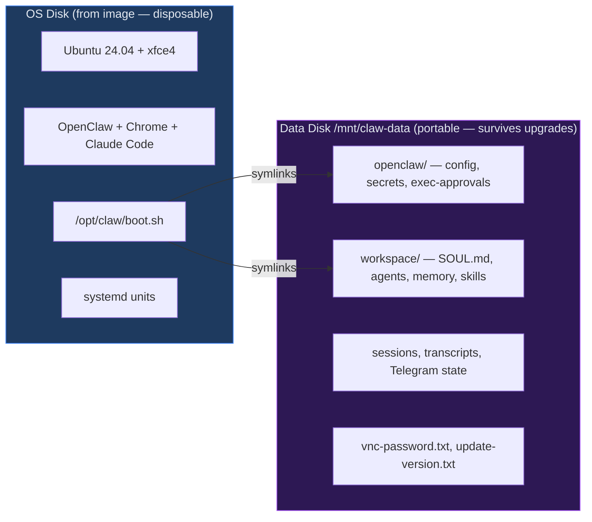
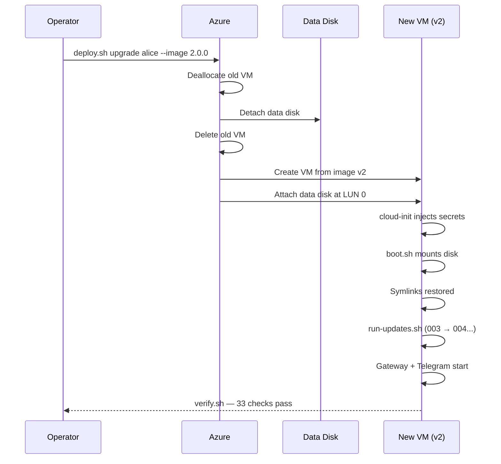
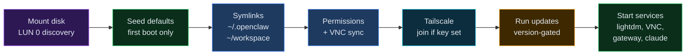
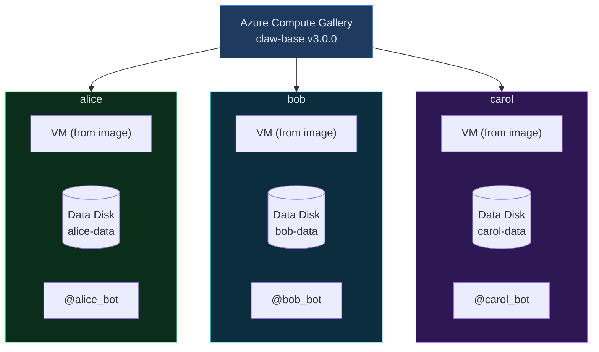

<p align="center">
  
</p>

# OpenClawps

MLOps-inspired CI/CD for [OpenClaw](https://openclaw.ai) agent fleets. Prescriptive, versioned system images provide a managed runtime. Portable data disks carry agent identity, workspace, and state across VM replacements and image upgrades. Deploy a fully equipped, desktop-running claw on Azure in one command. Upgrade it without losing state in another.

Architecture diagrams and topology: [challengelogan.com/openclawps](https://challengelogan.com/openclawps)

## What this adds to OpenClaw

- **One-command Azure deploy** -- `deploy.sh scratch` goes from zero to a working agent with Telegram, Chrome, and Claude Code in ~10 min. No manual VM setup.
- **Full graphical desktop** -- Real xfce4 desktop on `:0` with Chrome and VNC. Computer-use agents need a real browser and a real screen, not a headless shell.
- **Two-layer separation** -- The system (OS, packages, OpenClaw, boot logic) and the claw (identity, workspace, memory, credentials) are on separate disks. The system layer is an immutable, versioned image. The claw layer is a portable data disk you can detach, reattach to a different VM, or move to a new image version. The claw is not the VM -- it rides on top of it.
- **Stateful upgrades** -- Delete the old VM, create a new one from a new image, reattach the same data disk. The claw picks up where it left off. Migration scripts run automatically.
- **Fleet-friendly** -- Same image, different `.env`, different claw. Each gets its own Telegram bot, API keys, and workspace.
- **33-point health checks** -- `verify.sh` runs after every deploy and upgrade. Catches misconfigs before they become mystery failures.

## Architecture

### Two-layer separation

The system and the claw are on separate disks. The system is disposable. The claw is portable.



### Upgrade lifecycle

Delete the VM, keep the disk, create a new VM from a new image, reattach the disk. The claw picks up where it left off.



### Boot sequence

Every VM start runs `boot.sh`. Idempotent — safe to rerun, safe to reboot.



### Fleet topology

Same image, different `.env`, different claw. Each is independent.



## Deploying a claw

There are two deployment paths. **Terraform is preferred** -- it produces a declarative, diffable fleet state. The shell path still works for scratch installs and image baking.

### Prerequisites

- Azure CLI, authenticated (`az login`)
- Terraform on `PATH`
- An image version in the Compute Gallery (baked via Packer or `deploy.sh bake`)
- Shared infrastructure already deployed (resource group, VNet, NSG, gallery) -- either via `infra/azure/terraform/shared/` or the original shell scripts

### Terraform deployment (preferred)

1. **Define the claw** in `fleet/claws.yaml`. Each entry under `claws:` becomes a VM with its own data disk.

2. **Create secrets** in `infra/azure/terraform/fleet/secrets.auto.tfvars` (gitignored):

```hcl
claw_secrets = {
  my-claw = {
    telegram_bot_token   = "from @BotFather"
    xai_api_key          = "your key"
    openai_api_key       = ""
    anthropic_api_key    = ""
    moonshot_api_key     = ""
    deepseek_api_key     = ""
    brightdata_api_token = ""
    tailscale_authkey    = ""
  }
}
```

3. **Set your SSH public key** in `infra/azure/terraform/fleet/terraform.tfvars`:

```hcl
fleet_manifest_path  = "../../../../fleet/claws.yaml"
admin_ssh_public_key = "ssh-ed25519 AAAA... you@host"
```

4. **Init and apply** (using local backend for now -- add `backend_override.tf` with `terraform { backend "local" {} }`):

```bash
cd infra/azure/terraform/fleet
terraform init
terraform plan -var-file=terraform.tfvars    # review: 7 resources per claw
terraform apply -var-file=terraform.tfvars
```

5. **Wait ~2 minutes** for cloud-init and boot.sh to finish. boot.sh retries for up to 60 seconds if the data disk is still being attached by Terraform.

6. **Verify** by SSHing in and running `/opt/claw/verify.sh` (36-point health check), or message the Telegram bot.

Terraform creates per claw: public IP, NIC, NSG association, VM (from gallery image), data disk, disk attachment, and a random password. The data disk has `prevent_destroy` -- Terraform will refuse to delete claw state.

**To upgrade a claw**: change `image_version` in `claws.yaml` and `terraform apply`. Terraform destroys the VM and recreates it from the new image. The data disk survives. boot.sh re-mounts it and runs any pending update scripts.

**To add a claw**: add an entry to `claws.yaml`, add its secrets to `secrets.auto.tfvars`, and `terraform apply`.

### Shell deployment (legacy)

```bash
cp .env.template .env && vi .env
./bin/deploy.sh scratch             # stock Ubuntu → full install, ~10 min
./bin/deploy.sh bake 4.0.0          # capture image to gallery
./bin/deploy.sh upgrade alice --image 4.0.0
```

### What happens at boot

cloud-init writes secrets to `~/.openclaw/.env`. Then `/opt/claw/boot.sh` runs:

1. **Mount data disk** at `/mnt/claw-data` (waits up to 60s for Terraform disk attachment)
2. **Seed defaults** on first boot (config, workspace files, VNC password)
3. **Create symlinks** (`~/.openclaw` → disk, `~/workspace` → disk)
4. **Fix permissions** and sync VNC password
5. **Join Tailscale** if auth key is set
6. **Run update scripts** (`vm-runtime/updates/NNN-*.sh`) version-gated
7. **Start services** (lightdm, x11vnc, gateway)

boot.sh is idempotent -- safe to rerun, safe to reboot.

## Image lifecycle

**Image** = versioned system runtime (OS, packages, OpenClaw, Chrome, Claude Code, boot logic). **Data disk** = durable agent state (config, secrets, workspace, memory). Migration scripts in `vm-runtime/updates/` run automatically on upgrade.

```bash
# Build from source (Packer)
cd infra/azure/packer
packer init .
packer build -var subscription_id=$(az account show --query id -o tsv) -var image_version=4.0.0 .

# Or capture from a running VM (shell)
./bin/deploy.sh bake 4.0.0
```

## Repository layout

- `bin/deploy.sh` -- canonical operator entrypoint for the current shell-based workflow
- `infra/azure/shell/` -- Azure CLI implementation of scratch, bake, image, and upgrade
- `infra/azure/terraform/shared/` -- Terraform root for shared infrastructure (resource group, VNet, NSG, image gallery)
- `infra/azure/terraform/fleet/` -- Terraform root for claw VMs (per-claw resources driven by fleet manifest)
- `infra/azure/terraform/modules/` -- reusable Terraform modules (shared-infra, image-gallery, claw-vm)
- `infra/azure/packer/` -- Packer config and numbered install scripts for reproducible image builds
- `vm-runtime/` -- the VM payload: cloud-init templates, lifecycle scripts, seeded defaults, and update migrations
- `fleet/` -- the canonical fleet manifest consumed by Terraform
- `.github/workflows/` -- CI/CD: PR validation, image baking, fleet deployment
- `apps/topology/` -- isolated Vite/React app for the topology and architecture site

## CI/CD

Three GitHub Actions workflows automate the image-to-fleet pipeline:

| Workflow | Triggers | What it does |
|---|---|---|
| **Validate** (`validate.yml`) | PR touching `infra/`, `fleet/`, `vm-runtime/` | `terraform fmt -check`, `terraform validate`, `packer validate` |
| **Bake Golden Image** (`bake-image.yml`) | Push to main touching `packer/**` or `vm-runtime/**` | Packer build → publish to Compute Gallery |
| **Deploy Fleet** (`deploy-fleet.yml`) | Push to main touching `fleet/**` or `terraform/fleet/**`, or after a successful bake | Terraform plan → apply → `verify.sh` on each claw via SSH |

The deploy workflow uses a plan/apply split with a `production` environment gate. The verify job SSHs into each claw and runs the 33-point health check.

### GitHub secrets required

| Secret | Description |
|---|---|
| `AZURE_CLIENT_ID` | Service principal or managed identity client ID (OIDC) |
| `AZURE_TENANT_ID` | Azure AD tenant ID |
| `AZURE_SUBSCRIPTION_ID` | Target subscription |
| `TF_STATE_RESOURCE_GROUP` | Resource group for the Terraform state storage account |
| `TF_STATE_STORAGE_ACCOUNT` | Storage account name for remote state |
| `TF_STATE_CONTAINER` | Blob container name |
| `CLAW_SECRETS_JSON` | JSON object matching the `claw_secrets` Terraform variable |

### Azure OIDC setup

The workflows use [workload identity federation](https://learn.microsoft.com/en-us/entra/workload-id/workload-identity-federation) (OIDC) instead of stored credentials. Create a federated credential on your service principal for `repo:<owner>/<repo>:ref:refs/heads/main`.

## Terraform

Two separate Terraform roots under `infra/azure/terraform/`, each with its own state:

- **`shared/`** manages infrastructure deployed once: resource group, VNet, subnet, NSG, compute gallery, and image definition. Run this first, then leave it alone.
- **`fleet/`** manages per-claw resources: public IP, NIC, VM, data disk, and cloud-init. Add or remove claws by editing `fleet/claws.yaml` and re-applying here. Data sources look up the shared infrastructure -- fleet never creates or destroys networking or gallery resources.

Both roots read `fleet/claws.yaml` for configuration. `bin/deploy.sh` and the shell scripts remain a parallel entrypoint for scratch installs and image baking.

Validate without configuring remote state:

```bash
cd infra/azure/terraform/shared && terraform init -backend=false && terraform validate
cd infra/azure/terraform/fleet  && terraform init -backend=false && terraform validate
```

Create a secrets file before planning fleet. Do not commit it:

```hcl
# infra/azure/terraform/fleet/secrets.auto.tfvars
claw_secrets = {
  linux-desktop = {
    telegram_bot_token   = "123456789:token"
    xai_api_key          = ""
    openai_api_key       = ""
    anthropic_api_key    = ""
    moonshot_api_key     = ""
    deepseek_api_key     = ""
    brightdata_api_token = ""
    tailscale_authkey    = ""
  }
}
```

Each root expects an `azurerm` backend. Create a backend file per root with a distinct state key:

```hcl
# infra/azure/terraform/shared/backend.tfbackend
resource_group_name  = "tfstate"
storage_account_name = "tfstateexample"
container_name       = "tfstate"
key                  = "openclawps-shared.tfstate"
```

```hcl
# infra/azure/terraform/fleet/backend.tfbackend
resource_group_name  = "tfstate"
storage_account_name = "tfstateexample"
container_name       = "tfstate"
key                  = "openclawps-fleet.tfstate"
```

Plan and apply:

```bash
# Shared (once)
cd infra/azure/terraform/shared
terraform init -reconfigure -backend-config=backend.tfbackend
terraform apply -var-file=terraform.tfvars

# Fleet (day-to-day)
cd infra/azure/terraform/fleet
terraform init -reconfigure -backend-config=backend.tfbackend
terraform plan -var-file=terraform.tfvars -var-file=secrets.auto.tfvars
```

## Packer

Reproducible image builds under `infra/azure/packer/`. Numbered scripts in `scripts/` replace the monolithic `scratch.yaml` cloud-init install:

| Script | What it installs |
|---|---|
| `01-system-packages.sh` | xfce4, lightdm, x11vnc, build tools |
| `02-desktop-config.sh` | lightdm autologin, xorg dummy, systemd units |
| `03-nodejs-openclaw.sh` | Node.js 24, OpenClaw |
| `04-chrome.sh` | Google Chrome (.deb) |
| `05-claude-code.sh` | Claude Code CLI |
| `06-tailscale.sh` | Tailscale client |
| `07-system-setup.sh` | sudoers, service enablement |
| `99-cleanup.sh` | apt clean, waagent deprovision |

Packer also stages `vm-runtime/` files (boot.sh, run-updates.sh, defaults, updates) into `/opt/claw/` on the image. Two engineers building from the same commit get identical images.

## Configuration

Each claw gets its own `.env`:

| Key | Required | Notes |
|---|---|---|
At least one provider API key must be present for a claw to pass runtime verification.

| `TELEGRAM_BOT_TOKEN` | yes | Unique per claw -- one bot per token |
| `OPENCLAW_MODEL` | no | `xai/grok-4`, `openai/gpt-4o`, `anthropic/claude-4`, `moonshot/kimi-k2.5`, `deepseek/deepseek-chat`, etc. Default: `xai/grok-4` |
| `XAI_API_KEY` | * | Required if using xai/* models |
| `OPENAI_API_KEY` | * | Required if using openai/* models |
| `ANTHROPIC_API_KEY` | * | Required if using anthropic/* models |
| `MOONSHOT_API_KEY` | * | Required if using moonshot/* models |
| `DEEPSEEK_API_KEY` | * | Required if using deepseek/* models |
| `BRIGHTDATA_API_TOKEN` | no | Web research |
| `TELEGRAM_USER_ID` | no | Restricts who can DM the bot |
| `TAILSCALE_AUTHKEY` | no | Auto-joins your tailnet for remote gateway access |
| `VM_PASSWORD` | no | Auto-generated if blank. Same password for SSH and VNC. |

## Connect

```bash
ssh azureuser@<ip>                # SSH key or password from terraform output
open vnc://<ip>:5900              # same password as SSH
```

## Daily operations

```bash
az vm deallocate -g rg-linux-desktop -n my-claw   # stop billing
az vm start      -g rg-linux-desktop -n my-claw   # resume, services auto-start
```

## Security

Deliberately permissive inside the VM: sandbox off, full exec, passwordless sudo. The agent operates like a human at the keyboard. Containment lives at the infrastructure boundary (isolated resource group, scoped credentials), not inside the guest.

## Contributing

The project ships with a single permissive run mode on Azure. It's structured to be extended:

- **Run modes** -- restricted exec policies, network egress controls, hardened images
- **Cloud providers** -- GCP, AWS, bare metal
- **Image variants** -- headless, GPU, ARM
- **Channels** -- Slack, Discord, Matrix
- **Fleet ops** -- rollout orchestration, dashboards, auto-scaling

## Author

Built by [Logan Robbins](https://linkedin.com/in/loganrobbins) -- AI architect and researcher with 15+ years building production systems at Disney, Intel, Apple, and IBM. Currently AI Platform Architect at Disney and author of the [Parallel Decoder Transformer](https://arxiv.org/abs/2512.10054) paper on synchronized parallel generation. Previously built enterprise AI platforms at Intel and Apple, MLOps pipelines at IBM, and designed distributed systems at scale. Opinions about how agents should run in production come from actually running them there.

## License

[MIT](LICENSE)
