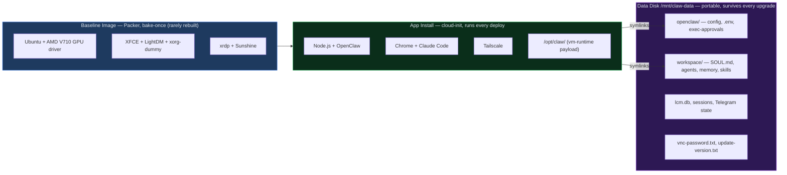
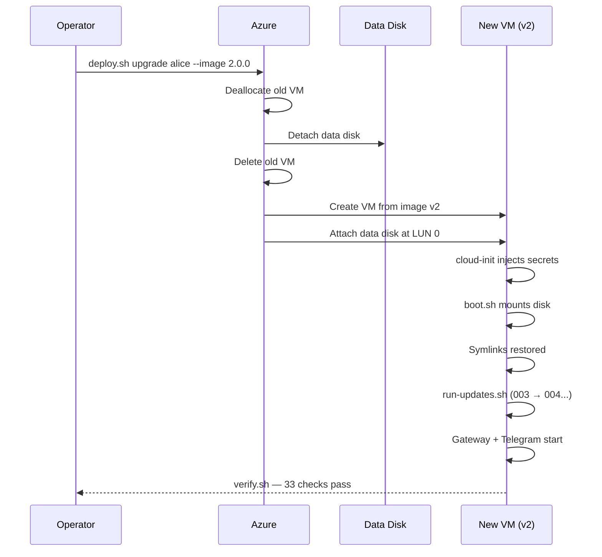
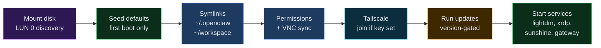
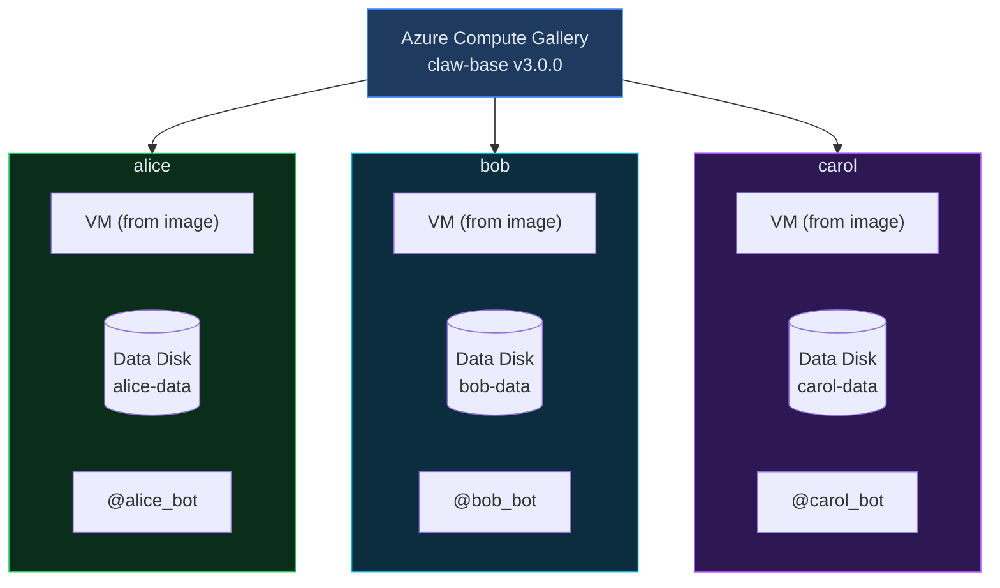

<p align="center">
  
</p>

# OpenClawps

MLOps-inspired CI/CD for [OpenClaw](https://openclaw.ai) agent fleets. A prescriptive, versioned baseline image provides the heavy OS/GPU/desktop runtime. A cheap cloud-init app layer installs the agent stack at deploy time, so iteration never requires a re-bake. Portable data disks carry agent identity, workspace, and state across VM replacements. Deploy a fully equipped, desktop-running claw on Azure with one `terraform apply`. Upgrade it without losing state with another.

Architecture diagrams and topology: [challengelogan.com/openclawps](https://challengelogan.com/openclawps)

> For repo-internal conventions, on-VM runbook, and agent operating rules, see [CLAUDE.md](CLAUDE.md). This README covers architecture and deploy; CLAUDE.md covers day-to-day operation.

## What this adds to OpenClaw

- **One-command Azure deploy** -- `terraform apply` in `infra/azure/terraform/fleet/` goes from zero to a working agent with Telegram, Chrome, and Claude Code in ~2 min (after the baseline image is baked once).
- **Full graphical desktop** -- Real XFCE desktop with RDP and Sunshine/Moonlight streaming. Computer-use agents need a real browser and a real screen, not a headless shell. Moonlight captures the same display (`:0`) the agent runs on, so you *see* the agent working and share its Chrome profile (GitHub/Google logins flow both ways).
- **Three-layer separation** -- **(1)** an immutable baseline image (OS + GPU driver + desktop + remote-access stack, baked by Packer, re-baked rarely), **(2)** an app install layer (Node, OpenClaw, Chrome, Claude Code, Tailscale, runtime payload — installed by cloud-init on every deploy, iterated without re-baking), and **(3)** a portable data disk (identity, workspace, memory, credentials — survives VM replacement). The claw is not the VM; it rides on top of it.
- **Stateful upgrades** -- Destroy the old VM, create a new one from the current image + re-run cloud-init, reattach the same data disk. The claw picks up where it left off. Migration scripts run automatically.
- **Fleet-friendly** -- Same image, different `.env`, different claw. Each gets its own Telegram bot, API keys, and workspace.
- **33-point health checks** -- `verify.sh` runs after every deploy and upgrade. Catches misconfigs before they become mystery failures.

## Architecture

### Three-layer separation

The system is split into two image layers (baseline + app) plus a portable data disk. The baseline is immutable and expensive to rebuild — so we keep it small and iterate on the app layer instead.



**Why the split matters.** Baking the OS + GPU driver + desktop takes ~30 min on a fresh Azure VM and is fragile (driver signing, kernel pinning). Baking the app layer into the same image would force a 30-minute rebuild for every Node/Chrome/OpenClaw change. Splitting them means a fleet redeploy is ~2 min and we touch Packer only when the OS/GPU/remote-access stack changes. See [CLAUDE.md — The three-layer model](CLAUDE.md#the-three-layer-model-critical-to-internalize) for the decision rule on which layer a change belongs in.

### Upgrade lifecycle

Delete the VM, keep the disk, create a new VM from a new image, reattach the disk. The claw picks up where it left off.



### Boot sequence

Every VM start runs `boot.sh`. Idempotent — safe to rerun, safe to reboot.



### Fleet topology

Same image, different `.env`, different claw. Each is independent.



## Deploying a claw

There are two deployment paths. **Terraform is preferred** -- it produces a declarative, diffable fleet state. The shell path still works for scratch installs and image baking.

### Prerequisites

- Azure CLI, authenticated (`az login`)
- Terraform on `PATH`
- An image version in the Compute Gallery (baked via Packer or `deploy.sh bake`)
- Shared infrastructure already deployed (resource group, VNet, NSG, gallery) -- either via `infra/azure/terraform/shared/` or the original shell scripts

### Terraform deployment (preferred)

1. **Define the claw** in `fleet/claws.yaml`. Each entry under `claws:` becomes a VM with its own data disk.

2. **Create secrets** in `infra/azure/terraform/fleet/secrets.auto.tfvars` (gitignored):

```hcl
claw_secrets = {
  my-claw = {
    telegram_bot_token   = "from @BotFather"
    xai_api_key          = "your key"
    openai_api_key       = ""
    anthropic_api_key    = ""
    moonshot_api_key     = ""
    deepseek_api_key     = ""
    brightdata_api_token = ""
    tailscale_authkey    = ""
  }
}
```

3. **Set your SSH public key** in `infra/azure/terraform/fleet/terraform.tfvars`:

```hcl
fleet_manifest_path  = "../../../../fleet/claws.yaml"
admin_ssh_public_key = "ssh-ed25519 AAAA... you@host"
```

4. **Init and apply** (using local backend for now -- add `backend_override.tf` with `terraform { backend "local" {} }`):

```bash
cd infra/azure/terraform/fleet
terraform init
terraform plan -var-file=terraform.tfvars    # review: 7 resources per claw
terraform apply -var-file=terraform.tfvars
```

5. **Wait ~2 minutes** for cloud-init and boot.sh to finish. boot.sh retries for up to 60 seconds if the data disk is still being attached by Terraform.

6. **Verify** by SSHing in and running `/opt/claw/verify.sh` (36-point health check), or message the Telegram bot.

7. **Post-deploy setup** (manual, one-time per claw):
   - **Gmail/Google Workspace**: OAuth flow via `gog` CLI. See [docs/GMAIL.md](docs/GMAIL.md) for the full procedure — this is a multi-step remote OAuth process that cannot be automated.
   - **GitHub**: `gh auth login --with-token` with a PAT, add SSH key via `gh ssh-key add`

Terraform creates per claw: public IP, NIC, NSG association, VM (from gallery image), data disk, disk attachment, and a random password. The data disk has `prevent_destroy` -- Terraform will refuse to delete claw state.

**To upgrade a claw**: change `image_version` in `claws.yaml` and `terraform apply`. Terraform destroys the VM and recreates it from the new image. The data disk survives. boot.sh re-mounts it and runs any pending update scripts.

**To add a claw**: add an entry to `claws.yaml`, add its secrets to `secrets.auto.tfvars`, and `terraform apply`.

### Shell deployment (legacy)

```bash
cp .env.template .env && vi .env
./bin/deploy.sh scratch             # stock Ubuntu → full install, ~10 min
./bin/deploy.sh bake 4.0.0          # capture image to gallery
./bin/deploy.sh upgrade alice --image 4.0.0
```

### What happens at boot

On first deploy, cloud-init installs the app layer (`vm-runtime/install/os/*.sh`) and writes secrets to `/mnt/claw-data/openclaw/.env`. cloud-init does **not** re-run on subsequent `az vm start`s. `/opt/claw/boot.sh` runs on every start:

1. **Mount data disk** at `/mnt/claw-data` (waits up to 60s for Terraform disk attachment)
2. **Seed defaults** on first boot (config, workspace files, VNC password)
3. **Create symlinks** (`~/.openclaw` → disk, `~/workspace` → disk)
4. **Fix permissions** and sync VNC password
5. **Join Tailscale** if auth key is set
6. **Run update scripts** (`vm-runtime/updates/NNN-*.sh`) version-gated
7. **Start services** (lightdm, xrdp, sunshine, openclaw-gateway on the `:0` session)

boot.sh is idempotent -- safe to rerun, safe to reboot. Gateway startup grace is ~11–12s on top of boot.

## Image lifecycle

- **Baseline image** (`claw-desktop-gpu` in `clawGalleryWest`) = OS + GPU driver + desktop + remote-access stack. Baked by Packer. Rare rebuilds: only when the OS, driver, or remote-protocol layer changes.
- **App install layer** = Node, OpenClaw, Chrome, Claude Code, Tailscale, vm-runtime payload. Installed by cloud-init on every fleet deploy from `vm-runtime/install/os/*.sh`. Iterate freely — no re-bake required.
- **Data disk** = durable agent state (config, secrets, workspace, memory). `prevent_destroy = true`. Migration scripts in `vm-runtime/updates/` replay on every start.

```bash
# Bake the baseline image (rare; only when OS/GPU/desktop layer changes)
cd infra/azure/packer/desktop
packer init .
packer build -var subscription_id=$(az account show --query id -o tsv) -var image_version=1.1.0 .

# Redeploy the fleet with a new app layer (common — iteration path)
cd infra/azure/terraform/fleet
terraform apply -var-file=terraform.tfvars -var-file=secrets.auto.tfvars
```

## Repository layout

- `bin/deploy.sh` -- legacy shell entrypoint (scratch, bake, upgrade); Terraform is the preferred path
- `infra/azure/shell/` -- Azure CLI implementation backing `bin/deploy.sh`
- `infra/azure/terraform/baseline/` -- single-VM root for developing the desktop layer and validating Packer inputs (not part of fleet deploy)
- `infra/azure/terraform/shared/` -- run-once infrastructure: resource group, VNet, NSG, Compute Gallery, image definition
- `infra/azure/terraform/fleet/` -- per-claw VMs, NICs, public IPs, data disks (driven by `fleet/claws.yaml`)
- `infra/azure/terraform/modules/` -- reusable modules: `shared-infra`, `image-gallery`, `claw-vm`
- `infra/azure/packer/desktop/` -- Packer config for the `claw-desktop-gpu` baseline image
- `vm-runtime/install/desktop/` -- scripts Packer runs at bake time (baseline image only)
- `vm-runtime/install/os/` -- scripts cloud-init runs at every fleet deploy (app install layer)
- `vm-runtime/lifecycle/` -- `boot.sh`, `run-updates.sh`, `verify.sh`, `start-claude.sh` staged to `/opt/claw/`
- `vm-runtime/defaults/` -- seeded onto a fresh data disk on first boot
- `vm-runtime/updates/NNN-*.sh` -- numbered, version-gated migrations replayed on every start
- `fleet/claws.yaml` -- canonical fleet manifest consumed by both shared and fleet Terraform roots
- `.github/workflows/` -- CI/CD: PR validation, image baking, fleet deployment
- `apps/topology/` -- isolated Vite/React app for the topology and architecture site

See [CLAUDE.md](CLAUDE.md) for the on-VM operational runbook (gateway plugin, `lcm.db`, gateway validator rules, Tailscale Serve, SCP workarounds).

## CI/CD

Three GitHub Actions workflows automate the image-to-fleet pipeline:

| Workflow | Triggers | What it does |
|---|---|---|
| **Validate** (`validate.yml`) | PR touching `infra/`, `fleet/`, `vm-runtime/` | `terraform fmt -check`, `terraform validate`, `packer validate` |
| **Bake Golden Image** (`bake-image.yml`) | Push to main touching `packer/**` or `vm-runtime/**` | Packer build → publish to Compute Gallery |
| **Deploy Fleet** (`deploy-fleet.yml`) | Push to main touching `fleet/**` or `terraform/fleet/**`, or after a successful bake | Terraform plan → apply → `verify.sh` on each claw via SSH |

The deploy workflow uses a plan/apply split with a `production` environment gate. The verify job SSHs into each claw and runs the 33-point health check.

### GitHub secrets required

| Secret | Description |
|---|---|
| `AZURE_CLIENT_ID` | Service principal or managed identity client ID (OIDC) |
| `AZURE_TENANT_ID` | Azure AD tenant ID |
| `AZURE_SUBSCRIPTION_ID` | Target subscription |
| `TF_STATE_RESOURCE_GROUP` | Resource group for the Terraform state storage account |
| `TF_STATE_STORAGE_ACCOUNT` | Storage account name for remote state |
| `TF_STATE_CONTAINER` | Blob container name |
| `CLAW_SECRETS_JSON` | JSON object matching the `claw_secrets` Terraform variable |

### Azure OIDC setup

The workflows use [workload identity federation](https://learn.microsoft.com/en-us/entra/workload-id/workload-identity-federation) (OIDC) instead of stored credentials. Create a federated credential on your service principal for `repo:<owner>/<repo>:ref:refs/heads/main`.

## Terraform

Three separate Terraform roots under `infra/azure/terraform/`, each with its own state:

- **`baseline/`** — optional, not part of the fleet path. Stands up a single `baseline-desktop` VM in `rg-linux-gpu-westus` to develop the desktop layer interactively before baking.
- **`shared/`** — infrastructure deployed once: resource group (`rg-claw-westus`), VNet, subnet, NSG, Compute Gallery (`clawGalleryWest`), and image definition (`claw-desktop-gpu`). Run first, then leave it alone.
- **`fleet/`** — per-claw resources: public IP, NIC, VM (from the gallery image), data disk, and cloud-init app install. Add or remove claws by editing `fleet/claws.yaml` and re-applying. Data sources look up the shared infrastructure — fleet never creates or destroys networking or gallery resources.

Both `shared/` and `fleet/` read `fleet/claws.yaml` for configuration. `bin/deploy.sh` and the shell scripts remain a parallel (legacy) entrypoint for scratch installs and image baking.

Validate without configuring remote state:

```bash
cd infra/azure/terraform/shared && terraform init -backend=false && terraform validate
cd infra/azure/terraform/fleet  && terraform init -backend=false && terraform validate
```

Create a secrets file before planning fleet. Do not commit it:

```hcl
# infra/azure/terraform/fleet/secrets.auto.tfvars
claw_secrets = {
  linux-desktop = {
    telegram_bot_token   = "123456789:token"
    xai_api_key          = ""
    openai_api_key       = ""
    anthropic_api_key    = ""
    moonshot_api_key     = ""
    deepseek_api_key     = ""
    brightdata_api_token = ""
    tailscale_authkey    = ""
  }
}
```

Each root expects an `azurerm` backend. Create a backend file per root with a distinct state key:

```hcl
# infra/azure/terraform/shared/backend.tfbackend
resource_group_name  = "tfstate"
storage_account_name = "tfstateexample"
container_name       = "tfstate"
key                  = "openclawps-shared.tfstate"
```

```hcl
# infra/azure/terraform/fleet/backend.tfbackend
resource_group_name  = "tfstate"
storage_account_name = "tfstateexample"
container_name       = "tfstate"
key                  = "openclawps-fleet.tfstate"
```

Plan and apply:

```bash
# Shared (once)
cd infra/azure/terraform/shared
terraform init -reconfigure -backend-config=backend.tfbackend
terraform apply -var-file=terraform.tfvars

# Fleet (day-to-day)
cd infra/azure/terraform/fleet
terraform init -reconfigure -backend-config=backend.tfbackend
terraform plan -var-file=terraform.tfvars -var-file=secrets.auto.tfvars
```

## Packer

Packer bakes the **baseline image only** — `claw-desktop-gpu` in `clawGalleryWest`, starting from the AMD V710 ROCm marketplace Ubuntu base. Config lives at `infra/azure/packer/desktop/` and calls these scripts from `vm-runtime/install/desktop/`:

| Script | What it installs |
|---|---|
| `01-system-packages.sh` | xfce4, lightdm, build tools |
| `03-display-config.sh` | lightdm autologin, xorg dummy, systemd units |
| `04-xrdp.sh` | xrdp (full desktop over 3389) |
| `05-sunshine.sh` | Sunshine streaming server (Moonlight-compatible) |

Everything else — Node.js, OpenClaw, Chrome, Claude Code, Tailscale, the `/opt/claw/` payload — installs at **deploy time** via cloud-init from `vm-runtime/install/os/*.sh`. That's the iteration loop; touching Packer is reserved for OS/GPU/remote-protocol changes.

## Configuration

Each claw pulls its per-VM secrets from `infra/azure/terraform/fleet/secrets.auto.tfvars` (gitignored; CI gets the same shape via the `CLAW_SECRETS_JSON` GitHub secret). Cloud-init writes them into `/mnt/claw-data/openclaw/.env` on the VM. At least one provider API key must be present for a claw to pass `verify.sh`.

| Key | Required | Notes |
|---|---|---|
| `telegram_bot_token` | yes | Unique per claw — one bot per token |
| `xai_api_key` | * | Required if using `xai/*` models |
| `openai_api_key` | * | Required if using `openai/*` models |
| `anthropic_api_key` | * | Required if using `anthropic/*` models |
| `moonshot_api_key` | * | Required if using `moonshot/*` models |
| `deepseek_api_key` | * | Required if using `deepseek/*` models |
| `brightdata_api_token` | no | Web research |
| `tailscale_authkey` | no | Auto-joins your tailnet for Tailscale Serve / remote chat-UI access |

The VM password is **not** a configuration input — Terraform generates one per claw via `random_password.vm_password` and surfaces it at `terraform output -raw -json claw_vm_passwords`. The same password is used for SSH, RDP, and Sunshine; it's also stored on the data disk at `/mnt/claw-data/vnc-password.txt` (kept under the `vnc-` name for backwards compatibility; Sunshine's admin password is seeded from it).

The default model and `telegram_user_id` are set under `defaults:` / per-claw in `fleet/claws.yaml`. Default model today: `xai/grok-4.20-0309-reasoning`.

## Connect

The chat UI (OpenClaw gateway, port 18789) is the primary interface to the agent; Moonlight gives you the graphical desktop *on the same display the agent uses*, so you can watch it work and share its Chrome profile. A single per-claw password is shared across SSH, RDP, and the Sunshine admin UI.

```bash
# Pull the claw's current IP and password from Terraform
cd infra/azure/terraform/fleet
IP=$(terraform output -json claw_public_ips | jq -r '.["chad-claw"]')
PW=$(terraform output -raw -json claw_vm_passwords | jq -r '.["chad-claw"]')

# Chat UI — Tailscale Serve (preferred; requires Serve enabled once at tailnet level)
open https://chad-claw.tailaef983.ts.net/

# Chat UI — SSH tunnel (zero-config fallback)
ssh -L 18789:127.0.0.1:18789 azureuser@$IP     # → http://localhost:18789/

# SSH shell
ssh azureuser@$IP

# Moonlight (agent's :0)       → $IP:47989      (admin UI: https://$IP:47990, same password)
# RDP (fresh XFCE per session) → $IP:3389       (user: azureuser, pass: $PW)
```

Moonlight captures `:0` — the display the agent runs on — so you see exactly what it sees. RDP spawns a per-connection session, so it does *not* share state with the agent; use it only if you need a separate isolated desktop. VNC (5900) is not in the default NSG; open it explicitly if you want a legacy fallback.

The password is also stored on the data disk at `/mnt/claw-data/vnc-password.txt` (mode 0600; the filename is historical — it's the same password used for SSH/RDP/Sunshine).

## Disconnect troubleshooting

If the tailnet UI looks like it is dropping in and out, check these three causes first:

- `apt-daily-upgrade.service` can briefly re-exec `systemd` and bounce core networking. On `2026-04-19`, this caused repeated `systemd-networkd` / `systemd-resolved` churn plus tailnet log lines like `LinkChange: all links down` and `dial tcp 127.0.0.1:18789: connect: connection refused` while the local HTTP target was unavailable.
- Ad hoc unit rewrites cause visible client disconnects even when the process itself is healthy. On `2026-04-19 23:39:25 UTC`, `/tmp/013-agent-on-display-zero.sh` explicitly stopped the UI service, reloaded units, and brought it back in a different display mode.
- Config clobbers fail hard. On `2026-04-19 02:15:53 UTC`, the config audit log recorded `gateway-mode-missing-vs-last-good`, which is the validator case that prevents startup and writes a `.clobbered.*` backup.

Operationally, brief tailnet flaps during unattended package activity are expected unless those timers are disabled or rescheduled. Persistent flapping after boot is not normal; inspect the boot journal, the tailnet journal, and the config audit log before changing service files by hand.

## Daily operations

```bash
# See what's running across the fleet (resource group is rg-claw-westus)
az vm list -g rg-claw-westus -d -o table

# Power state for a single claw
az vm get-instance-view -g rg-claw-westus -n chad-claw \
  --query "instanceView.statuses[?starts_with(code,'PowerState/')].code | [0]" -o tsv

# Stop billing for the night (keeps disks, static IP, Tailscale identity, lcm.db)
az vm deallocate -g rg-claw-westus -n chad-claw

# Resume — boot.sh replays idempotently, chat UI comes back ~30–60s later
az vm start      -g rg-claw-westus -n chad-claw
```

`deallocate` pauses compute billing; `stop` does not. Always use `deallocate` to park a claw overnight.

## Security

Deliberately permissive inside the VM: sandbox off, full exec, passwordless sudo. The agent operates like a human at the keyboard. Containment lives at the infrastructure boundary, not inside the guest.

Concretely, the fleet NSG (`rg-claw-westus-nsg`) runs **least-privilege** — inbound only on:

- **22/tcp** SSH — operator management
- **3389/tcp** RDP — per-session XFCE desktop
- **47984/47989/47990/48010 tcp + 47998-48002 udp** Sunshine/Moonlight — agent's `:0` session capture
- **41641/udp** Tailscale direct P2P — fallback is DERP relays

Everything else falls to Azure's implicit `DenyAll` at priority 65500. The chat UI (18789) stays loopback-bound and is reached only via Tailscale Serve or an SSH tunnel — it is never exposed directly. Scoping `source_address_prefix` to the operator's IP is a straightforward next step; would break the `deploy-fleet` verify job that SSHes from GitHub Actions runners.

## Contributing

The project ships with a single permissive run mode on Azure. It's structured to be extended:

- **Run modes** -- restricted exec policies, network egress controls, hardened images
- **Cloud providers** -- GCP, AWS, bare metal
- **Image variants** -- headless, GPU, ARM
- **Channels** -- Slack, Discord, Matrix
- **Fleet ops** -- rollout orchestration, dashboards, auto-scaling

## Author

Built by [Logan Robbins](https://linkedin.com/in/loganrobbins) -- AI architect and researcher with 15+ years building production systems at Disney, Intel, Apple, and IBM. Currently AI Platform Architect at Disney and author of the [Parallel Decoder Transformer](https://arxiv.org/abs/2512.10054) paper on synchronized parallel generation. Previously built enterprise AI platforms at Intel and Apple, MLOps pipelines at IBM, and designed distributed systems at scale. Opinions about how agents should run in production come from actually running them there.

## License

[MIT](LICENSE)
